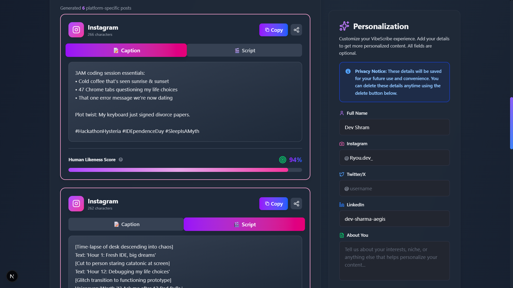
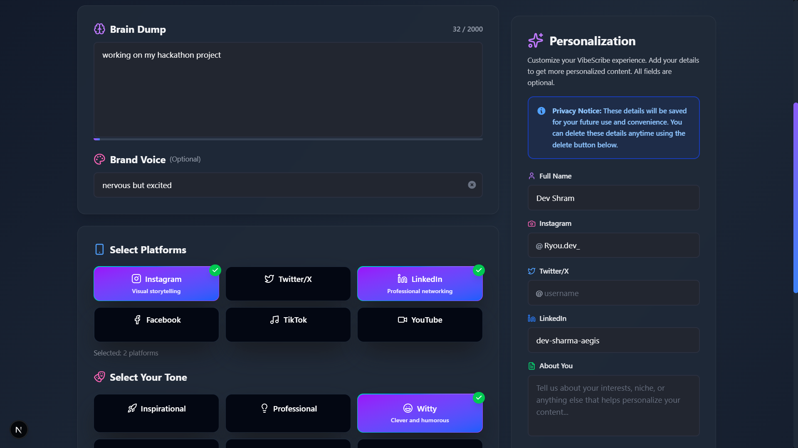

# VibeScribe 🚀

[](https://nextjs.org/)
[](https://www.typescriptlang.org/)
[](https://tailwindcss.com/)
[](https://opensource.org/licenses/MIT)

**VibeScribe** is an AI-powered content partner that transforms raw, unstructured thoughts into authentic, platform-specific social media posts. The goal is to generate content that feels genuinely human, maintains a consistent brand voice, and saves creators hours of time.

This project is a single-page web application built with Next.js. The core functionality revolves around taking user input, sending it to a backend API route which then calls the OpenRouter API with DeepSeek R1, and displaying the formatted results with a human-likeness score.

## 📸 Screenshots

### Main Interface - Input & Output


_Transform messy brain dumps into polished, platform-specific posts with AI-powered generation_

### Personalization & Platform Selection


_Customize your content with brand voice, tone selection, and save your profile for personalized results_

## ✨ Core Features

- **🧠 Unstructured Input:** A single "brain dump" text area for messy notes and ideas - no structure required!
- **🤖 AI-Powered Generation:** Leverages DeepSeek R1 via OpenRouter API for intelligent content creation.
- **🎨 Tone & Voice Customization:** Choose from multiple tones (Inspirational, Professional, Witty) and describe your unique brand voice.
- **📱 Multi-Platform Support:** Generates optimized content for Instagram, LinkedIn, Twitter/X, Facebook, TikTok, and YouTube.
- **✨ Human-Like Nuances:** AI focuses on natural language flow, varied sentence structure, and appropriate emoji usage.
- **👤 Personalization Box:** Save your profile information (name, social media handles, interests) for personalized content generation.
- **💾 Profile Management:** Create, update, and delete your profile with Supabase database persistence.
- **📊 Human Likeness Score:** Each generated post includes a score indicating how authentic and human-like it sounds.
- **📋 One-Click Copy:** Easily copy generated posts to clipboard with visual feedback.
- **🎯 Platform-Specific Formatting:** Content tailored to each platform's best practices and character limits.
- **🌙 Modern UI:** Clean, dark-themed interface with smooth animations and intuitive user experience.

## 🛠️ Tech Stack

This project is built with a modern, serverless-first tech stack:

- **Framework:** [Next.js](https://nextjs.org/) 15 (using the App Router with Server Actions)
- **Language:** [TypeScript](https://www.typescriptlang.org/) 5.0+
- **Styling:** [Tailwind CSS](https://tailwindcss.com/) v4 (with custom animations and gradients)
- **AI Service:** [OpenRouter API](https://openrouter.ai/) with [DeepSeek R1](https://openrouter.ai/models/deepseek/deepseek-r1) model
- **Database:** [Supabase](https://supabase.com/) (PostgreSQL) with Row Level Security policies
- **State Management:** React Hooks (`useState`, `useEffect`, `useCallback`)
- **API Routes:** Next.js API Routes for serverless functions
- **Icons & UI:** Lucide React for icons, custom components
- **Deployment:** [Vercel](https://vercel.com/) (recommended)
- **Environment:** Node.js 18+

## 📂 Project Structure

The project follows the standard Next.js App Router structure. Understanding this structure is key to navigating the codebase.

```
├── src/
│ ├── app/
│ │ ├── api/
│ │ │ ├── generate/
│ │ │ │ └── route.ts # The backend API endpoint. Handles OpenRouter API calls.
│ │ │ └── profile/
│ │ │   └── route.ts # API endpoint for user profile CRUD operations.
│ │ ├── components/
│ │ │ ├── ConfigSection.tsx # Component for tone selection and the generate button.
│ │ │ ├── ContentCard.tsx # Displays a single generated post with a copy button.
│ │ │ ├── InputSection.tsx # Component for the main textarea and brand voice input.
│ │ │ ├── OutputSection.tsx # Displays loading/error states and the grid of ContentCards.
│ │ │ └── PersonalizationBox.tsx # Component for user profile management.
│ │ ├── globals.css # Global styles for Tailwind CSS.
│ │ ├── layout.tsx # Root layout.
│ │ └── page.tsx # The main page component. Manages all application state.
│ ├── lib/
│ │ └── supabaseClient.ts # Supabase client configuration.
├── .env.local # For storing environment variables (API keys).
├── next.config.ts # Next.js configuration.
├── package.json
└── tsconfig.json
```

## 🚀 Getting Started

To get a local copy up and running, follow these simple steps.

### Prerequisites

- Node.js (v18 or later)
- npm or yarn
- An OpenRouter API key ([Get one here](https://openrouter.ai/keys))
- A Supabase account and project ([Get started here](https://supabase.com/))

### Installation

1.  **Clone the repository:**
    ```sh
    git clone https://github.com/AegisX-dev/VibeScribe.git
    ```
2.  **Navigate to the project directory:**
    ```sh
    cd vibescribe
    ```
3.  **Install NPM packages:**
    ```sh
    npm install
    ```
4.  **Set up Supabase:**

    - Create a new Supabase project
    - Go to the SQL Editor in your Supabase dashboard
    - Run the SQL script from `supabase-setup.sql` file in this repository
    - This will create the `profiles` table with proper RLS (Row Level Security) policies
    - **IMPORTANT:** The RLS policies are required for delete operations to work properly!

5.  **Set up environment variables:**
    Create a `.env.local` file in the root of the project and add your API keys:
    ```
    OPENROUTER_API_KEY=your_openrouter_api_key_here
    NEXT_PUBLIC_SITE_URL=http://localhost:3000
    NEXT_PUBLIC_SUPABASE_URL=your_supabase_project_url
    NEXT_PUBLIC_SUPABASE_ANON_KEY=your_supabase_anon_key
    ```
6.  **Run the development server:**
    ```sh
    npm run dev
    ```
    Open [http://localhost:3000](http://localhost:3000) with your browser to see the result.

## 🔌 API Endpoints

The application has two main API endpoints:

### `POST /api/generate`

This endpoint is responsible for communicating with the OpenRouter API service using the DeepSeek R1 model.

- **Request Body:**
  The frontend sends a JSON object with the user's input.

  ```json
  {
    "rawText": "My new AI product VibeScribe just launched. Built for a buildathon. It turns ideas into social posts.",
    "brandVoice": "Excited and energetic, like a startup founder on launch day.",
    "selectedTone": "🚀 Inspirational",
    "userProfile": {
      "id": "user-123",
      "full_name": "John Doe",
      "instagram_username": "@johndoe",
      "twitter_username": "@johndoe",
      "linkedin_username": "johndoe",
      "other_details": "Tech enthusiast and AI builder"
    }
  }
  ```

- **Success Response (200):**
  On success, the API returns a JSON object containing an array of generated posts.

  ```json
  {
    "posts": [
      {
        "platform": "Instagram",
        "content": "Just launched VibeScribe! 🚀 We built this AI content partner during a buildathon to turn messy ideas into magic social posts. So proud of the team! #AI #ContentCreation #StartupLife #Buildathon",
        "humanLikenessScore": 9
      },
      {
        "platform": "LinkedIn",
        "content": "Thrilled to announce the launch of VibeScribe, an AI-powered tool designed to help creators and solopreneurs transform raw thoughts into authentic, platform-specific content.\n\nOur goal was to solve the 'blank page' problem and create an AI that enhances, rather than replaces, the human voice. Excited for the journey ahead.\n\n#AI #SaaS #ContentMarketing #ProductLaunch",
        "humanLikenessScore": 9
      },
      {
        "platform": "Twitter/X",
        "content": "1/ We just launched VibeScribe! 🚀\n\nIt’s an AI tool born out of a buildathon that turns your brain dumps into clean, human-like social media posts for IG, LinkedIn, and more.\n\nNo more robotic content.",
        "humanLikenessScore": 10
      }
    ]
  }
  ```

- **Error Response (400):**
  If required fields are missing:

  ```json
  {
    "error": "Raw text is required"
  }
  ```

- **Error Response (500):**
  If the API call fails:
  ```json
  {
    "error": "Failed to generate content",
    "details": "Error message details"
  }
  ```

### `GET /api/profile?id={userId}`

Retrieves a user's profile information from the database.

- **Query Parameters:**

  - `id` (required): The unique user ID

- **Success Response (200):**

  ```json
  {
    "profile": {
      "id": "user-123",
      "full_name": "John Doe",
      "instagram_username": "@johndoe",
      "twitter_username": "@johndoe",
      "linkedin_username": "johndoe",
      "other_details": "Tech enthusiast and AI builder",
      "created_at": "2025-10-05T10:00:00Z",
      "updated_at": "2025-10-05T10:00:00Z"
    }
  }
  ```

- **No Profile Response (200):**
  ```json
  {
    "profile": null,
    "message": "No profile found. Please create one."
  }
  ```

### `POST /api/profile`

Creates or updates a user's profile in the database.

- **Request Body:**

  ```json
  {
    "id": "user-123",
    "full_name": "John Doe",
    "instagram_username": "@johndoe",
    "twitter_username": "@johndoe",
    "linkedin_username": "johndoe",
    "other_details": "Tech enthusiast and AI builder"
  }
  ```

- **Success Response (200):**

  ```json
  {
    "message": "Profile saved successfully!",
    "profile": {
      "id": "user-123",
      "full_name": "John Doe",
      "instagram_username": "@johndoe",
      "twitter_username": "@johndoe",
      "linkedin_username": "johndoe",
      "other_details": "Tech enthusiast and AI builder"
    }
  }
  ```

- **Error Response (400):**
  ```json
  {
    "error": "User ID is required."
  }
  ```

### `DELETE /api/profile?id={userId}`

Deletes a user's profile from the database.

- **Query Parameters:**

  - `id` (required): The unique user ID

- **Success Response (200):**

  ```json
  {
    "message": "Profile deleted successfully!"
  }
  ```

- **Error Response (400):**
  ```json
  {
    "error": "User ID is required."
  }
  ```

## 🎨 UI Components

### PersonalizationBox

The PersonalizationBox component allows users to save their profile information for personalized content generation.

**Features:**

- **Auto-save user ID:** Generates and stores a unique user ID in localStorage
- **Form fields:** Full name, Instagram, Twitter/X, LinkedIn usernames, and other details
- **Database persistence:** Saves data to Supabase
- **Auto-load:** Retrieves existing profile data on page load
- **Delete functionality:** Users can delete their profile with a confirmation modal
- **Visual feedback:** Success/error messages for all operations

**Usage:**

```tsx
<PersonalizationBox className="sticky top-8" />
```

## 🚀 Deployment

This project is optimized for deployment on Vercel:

1. Push your code to GitHub
2. Import your repository to Vercel
3. Add environment variables in Vercel dashboard:
   - `OPENROUTER_API_KEY`
   - `NEXT_PUBLIC_SITE_URL`
   - `NEXT_PUBLIC_SUPABASE_URL`
   - `NEXT_PUBLIC_SUPABASE_ANON_KEY`
4. Deploy!

## 📝 License

This project is open source and available under the MIT License.

## 🤝 Contributing

Contributions, issues, and feature requests are welcome! Feel free to check the issues page.

## 👨‍💻 Author

**Dev Sharma**

- GitHub: [@AegisX-Dev](https://github.com/AegisX-Dev)
- Instagram: [@Ryou.dev\_](https://instagram.com/Ryou.dev_)
- LinkedIn: [dev-sharma-aegis](https://linkedin.com/in/dev-sharma-aegis)

## 💡 About the Project

VibeScribe was built as part of a hackathon to solve a common problem: the "blank page syndrome" that content creators face. Instead of replacing human creativity, VibeScribe enhances it by transforming rough ideas into polished, platform-ready content that maintains your unique voice.

The project showcases:

- Modern React patterns with Next.js 15
- Integration with cutting-edge AI models (DeepSeek R1)
- Full-stack development with serverless architecture
- Database design with proper security policies
- Clean, responsive UI/UX design

---

Made with ❤️ using Next.js, TypeScript, and AI | Built during a Hackathon 🚀
